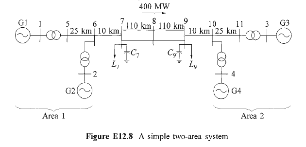

# EPSdynamix.jl


workflow for Electrical Power System studies in Julia (based on `Modia`)

## Introduction


## Installation


## Workflow

### read ECXEL file with BUS and BRANCH information

e.g. The two-area system used is example 12.6 in the textbook "Power System Stability and Control", written
by Prabha Kundur




### Convert XLSX to `ieee.txt` Format

converted XLSX as input for loadflow with `uwpflow`


```
BUS DATA FOLLOWS                             11 ITEMS
   1 GEN BUS1      1  1  3 1.030 0.00   0.00     0.00     693.19   135.18   16.50   1.030 900.00  -900.00 0.0000  0.0000      0
   2 GEN BUS2      1  1  2 1.010 -9.48  0.00     0.00     700.00   118.27   18.40   1.010 900.00  -900.00 0.0000  0.0000      0
   3 GEN BUS3      1  1  2 1.030 -15.23 0.00     0.00     719.00   135.73   13.80   1.030 900.00  -900.00 0.0000  0.0000      0
   4 GEN BUS4      1  1  2 1.010 -25.10 0.00     0.00     700.00   110.33   13.80   1.010 900.00  -900.00 0.0000  0.0000      0
   5 STA B230      1  1  0 1.014 -6.35  0.00     0.00     0.00     0.00     230.00  1.014 900.00  -900.00 0.0000  0.0000      0
   6 STA C230      1  1  0 0.997 -16.13 0.00     0.00     0.00     0.00     230.00  0.997 900.00  -900.00 0.0000  0.0000      0
   7 STA 2  7      1  1  0 0.994 -21.47 967.00   100.00   0.00     0.00     230.00  0.994 900.00  -900.00 0.0000  2.0000      0
   8 STA A230      1  1  0 0.993 -25.87 0.00     0.00     0.00     0.00     230.00  0.993 900.00  -900.00 0.0000  0.0000      0
   9 STA 3  9      1  1  0 0.998 -39.83 1767.00  100.00   0.00     0.00     230.00  0.998 900.00  -900.00 0.0000  3.5000      0
  10 STA 3 10      1  1  0 0.999 -31.75 0.00     0.00     0.00     0.00     230.00  0.999 900.00  -900.00 0.0000  0.0000      0
  11 STA 3 11      1  1  0 1.015 -21.74 0.00     0.00     0.00     0.00     230.00  1.015 900.00  -900.00 0.0000  0.0000      0
-999
BRANCH DATA FOLLOWS                         12 ITEMS
   5    6  1  1 1 0 0.0025    0.0250     0.0437        0     0     0   0  0  0.0000 0.0000 0.0000 0.0000  0.000  0.0000  0.0000
   6    7  1  1 1 0 0.0010    0.0100     0.0175        0     0     0   0  0  0.0000 0.0000 0.0000 0.0000  0.000  0.0000  0.0000
   7    8  1  1 1 0 0.0110    0.1100     0.1925        0     0     0   0  0  0.0000 0.0000 0.0000 0.0000  0.000  0.0000  0.0000
   7    8  1  1 1 0 0.0110    0.1100     0.1925        0     0     0   0  0  0.0000 0.0000 0.0000 0.0000  0.000  0.0000  0.0000
   8    9  1  1 1 0 0.0110    0.1100     0.1925        0     0     0   0  0  0.0000 0.0000 0.0000 0.0000  0.000  0.0000  0.0000
   8    9  1  1 1 0 0.0110    0.1100     0.1925        0     0     0   0  0  0.0000 0.0000 0.0000 0.0000  0.000  0.0000  0.0000
   9   10  1  1 1 0 0.0010    0.0100     0.0175        0     0     0   0  0  0.0000 0.0000 0.0000 0.0000  0.000  0.0000  0.0000
  10   11  1  1 1 0 0.0025    0.0250     0.0437        0     0     0   0  0  0.0000 0.0000 0.0000 0.0000  0.000  0.0000  0.0000
   1    5  1  1 1 1 0.0000    0.0167     0.0000        0     0     0   0  0  1.0000 0.0000 0.0000 0.0000  0.000  0.0000  0.0000
   2    6  1  1 1 1 0.0000    0.0167     0.0000        0     0     0   0  0  1.0000 0.0000 0.0000 0.0000  0.000  0.0000  0.0000
  11    3  1  1 1 1 0.0000    0.0167     0.0000        0     0     0   0  0  1.0000 0.0000 0.0000 0.0000  0.000  0.0000  0.0000
   4   10  1  1 1 1 0.0000    0.0167     0.0000        0     0     0   0  0  1.0000 0.0000 0.0000 0.0000  0.000  0.0000  0.0000
-999
END OF DATA
```


### Run loadflow with  `upwflow`

```
UW Continuation Power Flow (c)1992,1996,1999, 2006 C. Canizares, F. Alvarado and S. Zhang.
Summary of input data for case:

Base Solution:
Kundur 2area

      Loading factor -> 0
            AC buses -> 11
            PV buses -> 4
            X buses  -> 0
            Z buses  -> 0
            AC elem. -> 12
         V Reg. Trf. -> 0
        PQ Reg. Trf. -> 0
            DC buses -> 0
            DC lines -> 0
                SVCs -> 0
               TCSCs -> 0
            STATCOMs -> 0
           No. Areas -> 0
           Iterations -> 3 (Maximum = 50)
   Max. p.u. mismatch -> 1.215e-05 (Tolerance = 0.0001  )
    Reference Bus(es) -> 1 GEN BUS1     (Angle=  0.00 deg.)
```


### Create all elements based on the information from BUS and BRANCH

### Instantiate the full model

### Set initial values for the elements based on the loadflow results


```
┌─unit2::Generating Unit──────────────────┐
│ V0 = 1.025/9.28deg  P/Q = -1.630/-0.067 │
└─────────────────────────────────────────┘

    ┌─unit2.Generator::SM────────────────────────────────┐
    │ V0 = 1.025/9.28deg  P/Q = -1.630/-0.067  MVA=250.0 │
    │ ** tau = 0.653  uF = 1.268  phiKR = 0.564          │
    └────────────────────────────────────────────────────┘

    ┌─unit2.Governor::TConstant──┐
    │ ** T0 = -0.653             │
    └────────────────────────────┘

    ┌─unit2.AVR::AVR2─────────────────┐
    │ V0 = 1.025/9.28deg  uF0 = 1.268 │
    │ ** vSet = 1.031                 │
    └─────────────────────────────────┘

┌─unit3::Generating Unit─────────────────┐
│ V0 = 1.025/4.66deg  P/Q = -0.850/0.109 │
└────────────────────────────────────────┘

    ┌─unit3.Generator::SM───────────────────────────────┐
    │ V0 = 1.025/4.66deg  P/Q = -0.850/0.109  MVA=150.0 │
    │ ** tau = 0.567  uF = 1.118  phiKR = 0.458         │
    └───────────────────────────────────────────────────┘

    ┌─unit3.Governor::TConstant──┐
    │ ** T0 = -0.567             │
    └────────────────────────────┘

    ┌─unit3.AVR::AVR2─────────────────┐
    │ V0 = 1.025/4.66deg  uF0 = 1.118 │
    │ ** vSet = 1.031                 │
    └─────────────────────────────────┘

┌─loadZ5::Zload──────────────────────────┐
│ V0 = 0.996/-3.99deg  P/Q = 1.250/0.500 │
│ ** r = 0.684  x = 0.273                │
│ ** iRe = 1.218  iIm = -0.588           │
└────────────────────────────────────────┘
...
...
```


### RUN transient simulation
```
[+] set initial values.
[*] starting simulation.
  7.117766 seconds (5.08 M allocations: 243.627 MiB, 0.68% gc time, 93.98% compilation time: 9% of which was recompilation)
[+] simulation finished in 1.070168937 secs.
```


### OPTION: RUN Eigenvalue calculation


### OPTION: RUN Transfer function  calculation


