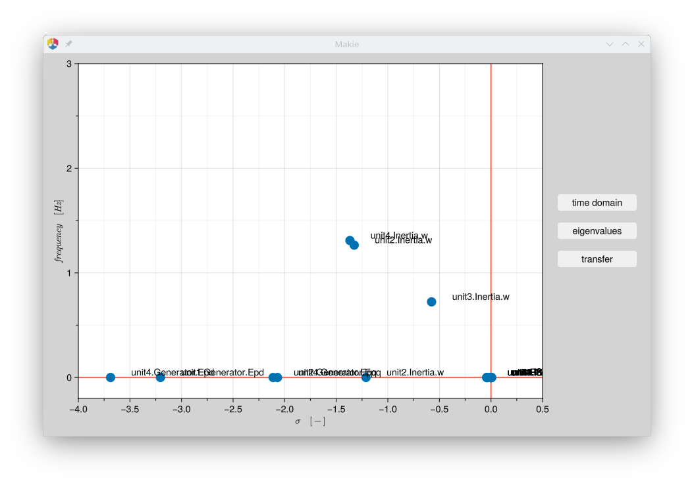

# EPSdynamix.jl


workflow for Electrical Power System studies

## Introduction


## Installation


## Workflow

### read ECXEL file with BUS ans BRANCH information

e.g. BUS data for a 9-Bus System


### Cconvert XLSX to `ieee.txt` Format

converted XLSX as input for loadflow with `uwpflow`


```
 30/07/05 UW ARCHIVE           100.00 2005 S Anderson9BusTest Case
BUS DATA FOLLOWS                             9 ITEMS
   1 Bus1  16.5kV  1  1  3 1.040 0.00   0.00     0.00     0.00     0.00     16.50   1.040 500.00  -500.00 0.0000  0.0000      0
   2 Bus2    18kV  1  1  2 1.025 0.00   0.00     0.00     163.00   0.00     18.00   1.025 99.00   -99.00  0.0000  0.0000      0
   3 Bus3  13.8kV  1  1  2 1.025 0.00   0.00     0.00     85.00    0.00     13.80   1.025 99.00   -99.00  0.0000  0.0000      0
   4 Bus4   230kV  1  1  0 1.000 0.00   0.00     0.00     0.00     0.00     230.00  0.000 0.00    0.00    0.0000  0.0000      0
   5 Bus5   230kV  1  1  0 1.000 0.00   125.00   50.00    0.00     0.00     230.00  0.000 0.00    0.00    0.0000  0.0000      0
   6 Bus6   230kV  1  1  0 1.000 0.00   90.00    30.00    0.00     0.00     230.00  0.000 0.00    0.00    0.0000  0.0000      0
   7 Bus7   230kV  1  1  0 1.000 0.00   0.00     0.00     0.00     0.00     230.00  0.000 0.00    0.00    0.0000  0.0000      0
   8 Bus8   230kV  1  1  0 1.000 0.00   100.00   35.00    0.00     0.00     230.00  0.000 0.00    0.00    0.0000  0.0000      0
   9 Bus9   230kV  1  1  0 1.000 0.00   0.00     0.00     0.00     0.00     230.00  0.000 0.00    0.00    0.0000  0.0000      0
-999
BRANCH DATA FOLLOWS                          9 ITEMS
   1    4  1  1 1 1 0.0000    0.0576     0.0000        0     0     0   0  0  1.0000 0.0000 0.0000 0.0000  0.000  0.0000  0.0000
   2    7  1  1 1 1 0.0000    0.0625     0.0000        0     0     0   0  0  1.0000 0.0000 0.0000 0.0000  0.000  0.0000  0.0000
   3    9  1  1 1 1 0.0000    0.0586     0.0000        0     0     0   0  0  1.0000 0.0000 0.0000 0.0000  0.000  0.0000  0.0000
   4    5  1  1 1 0 0.0100    0.0850     0.1760        0     0     0   0  0  0.0000 0.0000 0.0000 0.0000  0.000  0.0000  0.0000
   4    6  1  1 1 0 0.0170    0.0920     0.1580        0     0     0   0  0  0.0000 0.0000 0.0000 0.0000  0.000  0.0000  0.0000
   5    7  1  1 1 0 0.0320    0.1610     0.3060        0     0     0   0  0  0.0000 0.0000 0.0000 0.0000  0.000  0.0000  0.0000
   6    9  1  1 1 0 0.0390    0.1700     0.3580        0     0     0   0  0  0.0000 0.0000 0.0000 0.0000  0.000  0.0000  0.0000
   7    8  1  1 1 0 0.0085    0.0720     0.1490        0     0     0   0  0  0.0000 0.0000 0.0000 0.0000  0.000  0.0000  0.0000
   8    9  1  1 1 0 0.0119    0.1008     0.2090        0     0     0   0  0  0.0000 0.0000 0.0000 0.0000  0.000  0.0000  0.0000
-999
END OF DATA

```


### Run loadflow with  `upwflow`

```
UW Continuation Power Flow (c)1992,1996,1999, 2006 C. Canizares, F. Alvarado and S. Zhang.
Summary of input data for case:
Anderson9BusTest Case

            AC buses -> 9
            PV buses -> 3
            X buses  -> 0
            Z buses  -> 0
            AC elem. -> 9
         V Reg. Trf. -> 0
        PQ Reg. Trf. -> 0
            DC buses -> 0
            DC lines -> 0
                SVCs -> 0
               TCSCs -> 0
            STATCOMs -> 0
           No. Areas -> 0
   Reference Bus(es) -> 1 Bus1  16.5kV (Angle=  0.00 deg.)
*** The data has been read successfully ***

Iteration:  1  Maximum mismatch:     1.63  Equation: 1  AC bus: 2
Iteration:  1  Maximum mismatch:   0.1875  Equation: 2  AC bus: 7
Iteration:  2  Maximum mismatch: 0.002147  Equation: 2  AC bus: 7
Iteration:  3  Maximum mismatch: 3.421e-07  Equation: 1  AC bus: 7
**** Base Case Solved ****
```


### Create all elements based on the information from BUS and BRANCH

### Instantiate the full model

### Set initial values for the elements based on the loadflow results


```
┌─unit2::Generating Unit──────────────────┐
│ V0 = 1.025/9.28deg  P/Q = -1.630/-0.067 │
└─────────────────────────────────────────┘

    ┌─unit2.Generator::SM────────────────────────────────┐
    │ V0 = 1.025/9.28deg  P/Q = -1.630/-0.067  MVA=250.0 │
    │ ** tau = 0.653  uF = 1.268  phiKR = 0.564          │
    └────────────────────────────────────────────────────┘

    ┌─unit2.Governor::TConstant──┐
    │ ** T0 = -0.653             │
    └────────────────────────────┘

    ┌─unit2.AVR::AVR2─────────────────┐
    │ V0 = 1.025/9.28deg  uF0 = 1.268 │
    │ ** vSet = 1.031                 │
    └─────────────────────────────────┘

┌─unit3::Generating Unit─────────────────┐
│ V0 = 1.025/4.66deg  P/Q = -0.850/0.109 │
└────────────────────────────────────────┘

    ┌─unit3.Generator::SM───────────────────────────────┐
    │ V0 = 1.025/4.66deg  P/Q = -0.850/0.109  MVA=150.0 │
    │ ** tau = 0.567  uF = 1.118  phiKR = 0.458         │
    └───────────────────────────────────────────────────┘

    ┌─unit3.Governor::TConstant──┐
    │ ** T0 = -0.567             │
    └────────────────────────────┘

    ┌─unit3.AVR::AVR2─────────────────┐
    │ V0 = 1.025/4.66deg  uF0 = 1.118 │
    │ ** vSet = 1.031                 │
    └─────────────────────────────────┘

┌─loadZ5::Zload──────────────────────────┐
│ V0 = 0.996/-3.99deg  P/Q = 1.250/0.500 │
│ ** r = 0.684  x = 0.273                │
│ ** iRe = 1.218  iIm = -0.588           │
└────────────────────────────────────────┘
...
...
```


### RUN transient simulation
```
[+] set initial values.
[*] starting simulation.
  7.117766 seconds (5.08 M allocations: 243.627 MiB, 0.68% gc time, 93.98% compilation time: 9% of which was recompilation)
[+] simulation finished in 1.070168937 secs.
```


### OPTION: run Eigenvalue calculation

### OPTION: run Transfer function  calculation


### Transient simulation in time domain


### Eigenvalues




### Transfer functions


