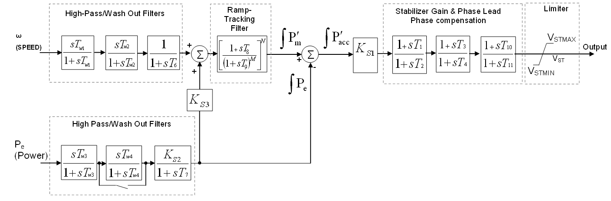

# PSS2B - Modia implementation


## Installation

It is recommended to use the latest version of `Modia` from GitHub.

```julia
] add https://github.com/ModiaSim/ModiaBase.jl.git
] add https://github.com/ModiaSim/Modia.jl.git

```

## Motivation

### existing tools

There are different open-source tools based on MODELICA for simulating electrical power systems.

* [OpenIPSL](https://github.com/OpenIPSL/OpenIPSL)
* [PowerGrids](https://github.com/PowerGrids/PowerGrids)


All packages contain models for electrical machines (at various levels), transmission elements, loads, and controls.

There are several options for initialization:

1. Use an additional tool (e.g., Python-based) to run a load flow and create the corresponding `*.mo` files, including starting parameters.

2. Use an `initial equation` section to describe the start conditions. This method has some limitations, and there is no solution for complex systems with more than 20 buses.


### alternative approach


The idea was to provide system initialization at different levels.

1. Run load-flow with an external tool ´uwpflow´ to determine bus-voltages and P/Q of all components

2. Perform the initialization for the generator (based on volts, P/Q) to get the `field voltage` and `torque`.

3. Run initialization of AVR (based on `uF`) to determine voltage set-point

4. Run initialization of loads, transmission lines, PSS, ...


In the end, all components have the correct start conditions and the simulation for defined scenarios can be started.

In my approach I used the `Modia` system for the following reasons:


#### advantages

* well known MODELICA philosophy

* Models are stored in `OrderedDicts`. Elements in this Dict can be easily added and modified.

* One model for time and frequency domain studies.

#### disadvantages

* Dead end, but results could be useful for other projects (?)


## Test case PSS2B

To illustrate how my initialization works, I have prepared an example for the `IEEE PSS2B` Power System Stabilizer.

This block consists of a transfer function and is linear. So state space representation can be used.


```julia
SS = Model(
    A = parameter | fill(0.0,0,0),
    B = parameter | fill(0.0,0,0),
    C = parameter | fill(0.0,0,0),
    D = parameter | fill(0.0,0,0),
    u = input,
    y = output,
    x = Var(init = zeros(0)),
    equations = :[
        der(x) = A*x + B*u
             y = C*x + D*u
    ]
)
```




### `Pss2bA.jl`


* Each model has a reference to an INIT function `initFktL1 = IniFkt(fktcall=PSS2Binit)`.
* The transfer functions for each block are defined and converted to state space.
* The parameters A,B,C,D,x0 are set in the model

```julia
function PSS2Binit(para)
    ...
    # wash out  A_omega B_power
    aw = tf([Tw1,0],[Tw1,1]) * tf([Tw2,0],[Tw2,1]) * tf([1.0],[T6,1])
    bw = tf([Tw3,0],[Tw3,1]) * tf([Ks2],[T7,1])
    ## ramp tracking
    rt =  (tf([1],[T9,1])^M * tf([T8,1],[1]))^N
    # phase comp
    pc = tf([T1,1],[T2,1]) * tf([T3,1],[T4,1])
...
```

```julia
PSS2Btest = Model(
    initFktL1 = IniFkt(fktcall=PSS2Binit),

    # all parameters
    Tw1 = 10.0, Tw2 = 10.0, Tw3 = 10.0,
    ...
    out = output,
    washoutA = SS,   washoutB = SS,    rampTrack = SS,  phaseComp = SS,

    equations = :[
        washoutA.u = w0
        washoutB.u = p0 + 0.01*time
        rampTrack.u = washoutA.y[1,1] + Ks3*Pe
        Pe = washoutB.y[1,1]
        Pm = rampTrack.y[1,1]
        Pacc = Pm - Pe
        phaseComp.u = Ks1*Pacc
        out = phaseComp.y[1,1]
    ]
)

instModel = @instantiateModel(PSS2Btest,  ....

PSS2Btest[:initFktL1][:fktcall](instModel.parameters)

```


### `Pss2bB.jl`

The same approach as described above, with the following differences:

* Only 1 StateSpace model with 2 inputs and 1 output

* System is linear => simple initialization


### Results

* `Pss2bA.jl` and `Pss2bB.jl` show the same results.

* TF elements can be removed by adjusting parameters, e.g.

```
T1 = 0.0
T2 = 0.0
tf([T1,1],[T2,1])
TransferFunction{Continuous, ControlSystemsBase.SisoRational{Float64}}
1.0
---
1.0

```


